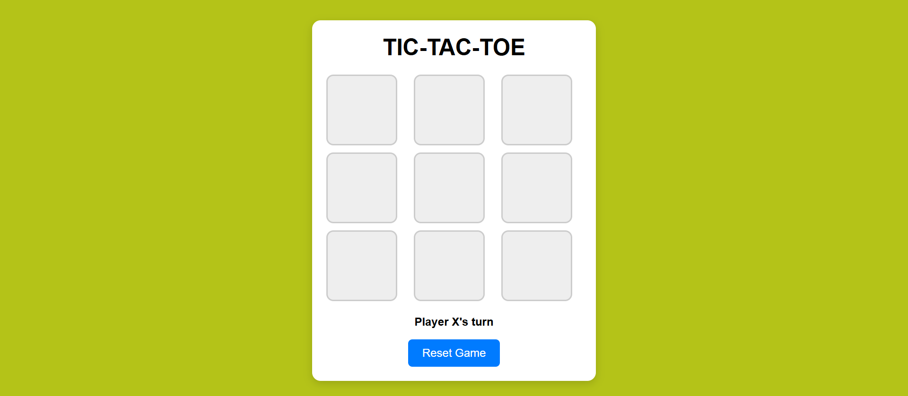

# 🎮 Tic-Tac-Toe Game - Task 03

A simple and responsive **Tic-Tac-Toe** web game built using **HTML**, **CSS**, and **Vanilla JavaScript**. Two players (X and O) can play turn by turn, with win and draw detection, all wrapped in a clean UI.

---

## 🔥 Features

- ✅ Two-player gameplay (X vs O)
- 🎯 Indicates current player's turn
- 🏆 Detects winning combinations and draw
- 🔁 Reset button to restart the game anytime
- 📱 Responsive layout for mobile and desktop
- 🎨 Light, simple, and clean design

---

## 🛠️ Tech Stack

- 🌐 HTML – Structure of the game
- 🎨 CSS – Styling and responsive layout
- ⚙️ JavaScript – Game logic and interactivity

---

## 🚀 Live Demo

👉 [Play the Game Here](https://snehasich.github.io/SCT_WD_3/)

---

## 📸 Screenshot

  
<!-- Replace 'screenshot.png' with your actual image file in the repo -->

---

## 🧑‍💻 How to Run Locally

1. 📥 Clone the repository:
   
```bash
  git clone https://github.com/Snehasich/SCT_WD_3.git

2. 📂 Navigate into the project folder:

```bash
  cd SCT_WD_3

3. 🌐 Open the game in your browser:

```bash
  start index.html      # For Windows
  open index.html       # For macOS
  xdg-open index.html   # For Linux

